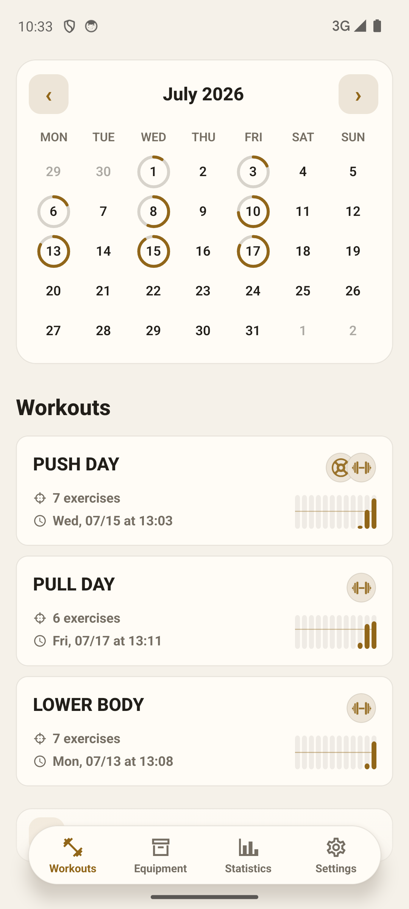
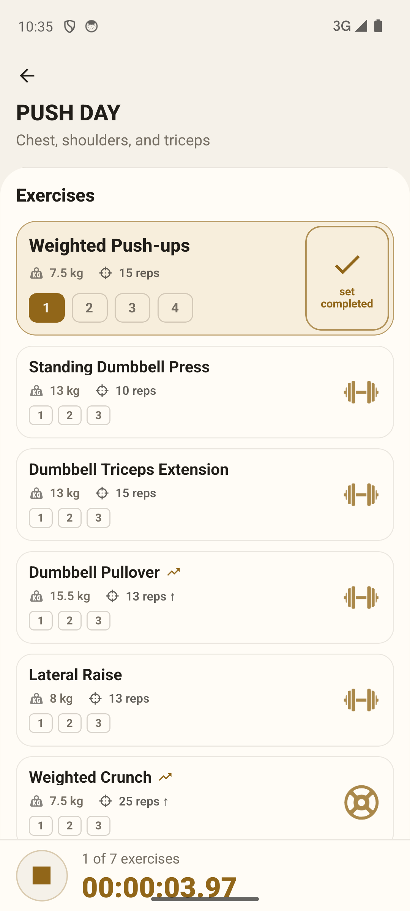
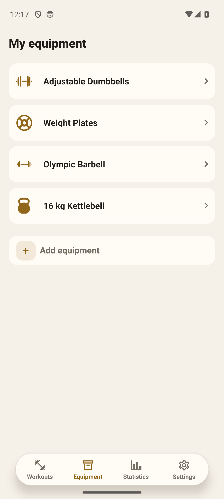
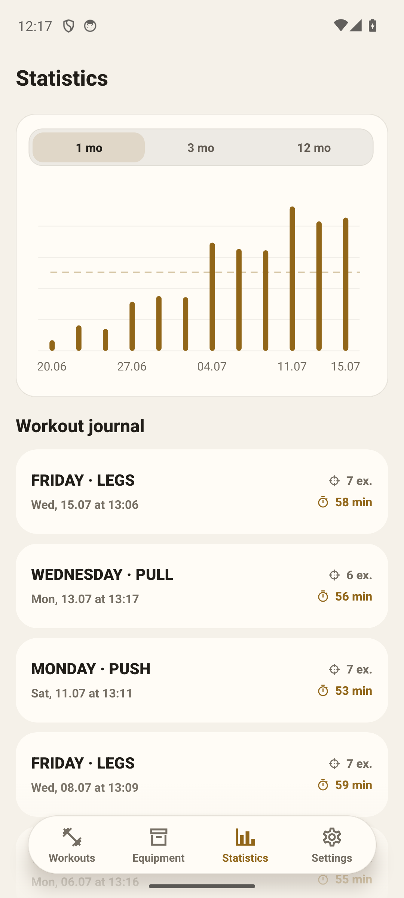
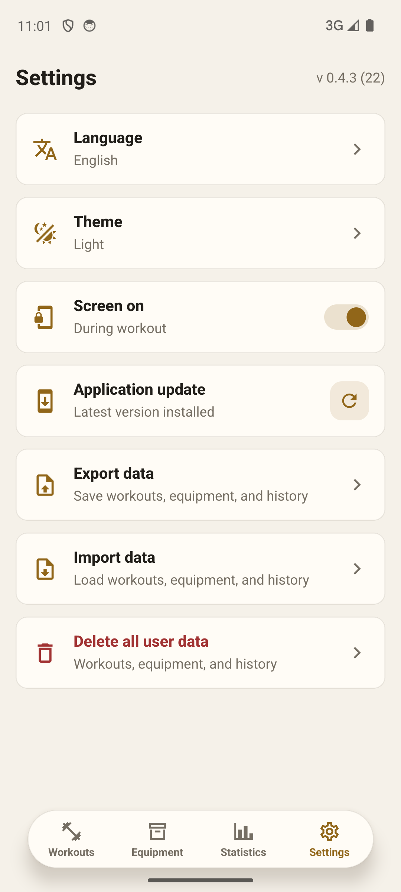

# IronSet

### Strength training without the noise

IronSet is a workout planner and training log for people who train on their
own. Build a routine around the equipment available at your gym or home, work
through it set by set, and track your progress in one place.

No mandatory account, social feed, or cluttered screens. Your training data
stays on your device and remains available even when you are offline.

## What IronSet can do

- **Plan your workouts.** Add exercises, sets, rep ranges, working weights, and
  rest times.
- **Stay focused while training.** Mark completed sets, follow the rest timer,
  and move to the next exercise without losing your flow.
- **Work with the equipment you have.** Save your dumbbells, kettlebells,
  barbells, and plates to choose realistic weights and progress gradually.
- **See your progress.** Workout history, training logs, and load charts make
  consistency and improvements easy to follow.
- **Stay in control of your data.** Export a backup and restore your workouts,
  equipment, and training history whenever needed.
- **Make it yours.** Choose English or Russian, switch between light and dark
  themes, and install optional updates directly from the app.

## See IronSet in action

<table>
  <tr>
    <td align="center">
      <strong>Workout plan</strong>  
      <picture>
        <source media="(prefers-color-scheme: dark)" srcset="screenshots/workouts-dark.png">
        
      </picture>
    </td>
    <td align="center">
      <strong>Set-by-set training</strong>  
      <picture>
        <source media="(prefers-color-scheme: dark)" srcset="screenshots/active-workout-dark.png">
        
      </picture>
    </td>
  </tr>
  <tr>
    <td align="center">
      <strong>Your equipment</strong>  
      <picture>
        <source media="(prefers-color-scheme: dark)" srcset="screenshots/equipment-dark.png">
        
      </picture>
    </td>
    <td align="center">
      <strong>History and statistics</strong>  
      <picture>
        <source media="(prefers-color-scheme: dark)" srcset="screenshots/statistics-dark.png">
        
      </picture>
    </td>
  </tr>
  <tr>
    <td align="center" colspan="2">
      <strong>Settings and backups</strong>  
      <picture>
        <source media="(prefers-color-scheme: dark)" srcset="screenshots/settings-dark.png">
        
      </picture>
    </td>
  </tr>
</table>

## Who it is for

IronSet is built for independent strength training at the gym or at home. It
helps you follow your own program, remember your working weights, and understand
your progress—from your first recorded set to months of consistent training.

## Install on Android

1. Open the [latest release](https://github.com/DissNik/IronSet-Releases/releases/latest)
   and download the APK file.
2. Open the file on your Android device and confirm the installation. Android
   may first ask you to allow app installations from the selected source.
3. Future versions can be installed from **Settings** in IronSet. An update only
   starts after you confirm it.

To preserve your training history, install each new version over the existing
app. Do not uninstall IronSet or clear its data before updating.
